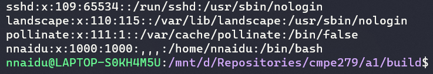
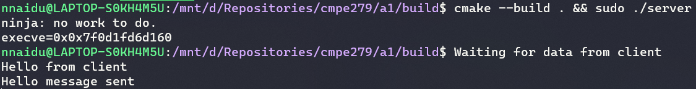
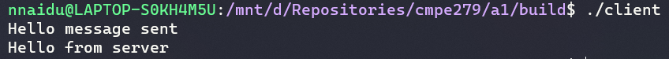

# CMPE 279 Assignment 1

# Pre-requisites

- CMake version 3.10 or higher
- WSL / Ubuntu 20.04 LTS / Similar linux compatible machine
- GCC 9.3 or equivalent
- Ninja

# Generate and Build

- Git clone this repository
- `cd a1`
    - NOTE, All the commands mentioned below are run from the `a1` folder.

```bash
# Generates ninja project in the build folder
# All binaries / intermediate files are built inside this
cmake -B build -G Ninja

# Build binaries
cmake --build build
```

# Testing

```bash
cd build

chmod +x ./server
chmod +x ./client

# Run the server and client
sudo ./server
./client
```

# Explanation for Server privilege seperation

- Check users in `/etc/passwd` file



- After `server` socket has been established it needs to wait for the `client` to establish connection.
  - i.e the `accept` API waits for `client`
  - Since all the socket setup is done before we can drop the privilege to default UID.
- Before the `accept` function call we run our custom `invoke_child` function
  - The `invoke_child` function calls the `fork` system call.
  - If parent pid we gracefully exit
  - If error pid we exit with error
  - If child pid we setuid to our user i.e **1000** as seen in the image above
- The `accept` API is now called by the child process only since the parent process has already exited gracefully.
- We then run our `client` binary and see output
  - See images below

## Server output



## Client output


