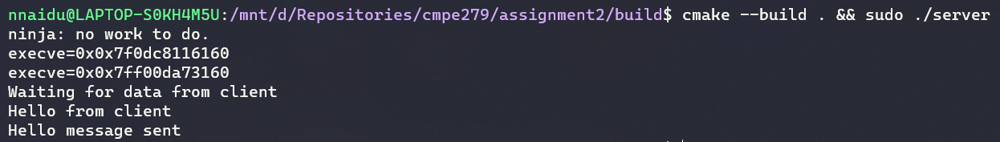

# CMPE 279 Assignment 2

Team Members:
- Niket Naidu: (013830115)

# Pre-requisites

- CMake version 3.10 or higher
- WSL / Ubuntu 20.04 LTS / Similar linux compatible machine
- GCC 9.3 or equivalent
- Ninja
- Read `assignment1/README.md` for build steps via CMake

# Testing

```bash
cd build

chmod +x ./server
chmod +x ./client

# Run the server and client
sudo ./server
./client
```

# Requirement for `execv`

- NOTE, Read `assignment1/README.md` for `fork` and `setuid` usage. 
  - Code has been restructured to handle `execv` on `./server`

- After `fork` and `setuid` call to reduce priviledge of server after socket is established we can further improve security through `execv`.
- Fork calls the child and starts execution from the next line for both child and parent. Both child and parent also share the same address space
- Execv however re-runs the program i.e similar to calling the program from the command line. This ensures that the address space is randomized and any sensitive data is set to default values.


# Code Explanation

## State Variables

- `program_state_e arg_pstate` value that holds the value of PARENT or CHILD when execv is called.
  - Default value is `PARENT`
- `int arg_socket_fb` value that holds the value of server socket file descriptor (hasn't been closed yet and child can reference it to accept connections)
  - Default value is `-1`

## Functions

- Processing command line arguments is done through the `arg_process_cli` function
  - This function checks for `-c` and `-s <socket_fd>` values
  - Updates the state variables mentioned above
  - The program state and socket descriptor can be queried by equivalent getters i.e `arg_get_program_state` and `arg_get_server_socket_fd`
- `invoke_exec(int socket_fd)` takes the forked child process and execs the `./server` executable for address space randomization.
  - The server calls itself
  - Passes arguments `-c` and `-s <socket_fd>` values.
  - `-c` means that `./server` is in the child state
  - `-s <socket_fd>` is the socket file descriptor to accept connections from

## Execution

- User runs the program by `sudo ./server`
  - Initially program is called with no arguments
  - Default states are `PARENT` and -1 for socket fd
- Pass 1
  - In `main` the `parent_run` function is selected
  - The `parent_run` function is similar to assignment 1
  - It binds the socket to PORT 80
  - Calls `invoke_fork` where child process is created
  - Calls `invoke_exec` where child process re-execs
- Pass 2
  - `invoke_exec` from Pass 1 sends `-c` and `-s <socket_fd>` values
  - In `main` the `child_run` function is selected due to the `-c` call
  - The `child_run` function accepts connection over the existing socket via `-s <socket_fd>`
  - The rest of the program involves receiving data from the client and transmitting one message back before terminating

# Images

## Client

- Same as `assignment1`

## Server


